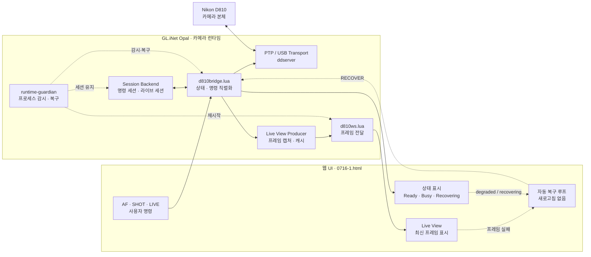

# D810 무선 카메라 시스템 · 0719 프로토타입 여정 기록 · 1.0 Alpha

작성일: 2026-07-19  
대상: Nikon D810 + GL.iNet Opal + 웹 UI  
버전: 1.0 Alpha  
기준 UI: `/remote-ui/0716-1.html`  
오팔 주소: `192.168.8.1`  
판정: 오팔 실기 검증 완료 프로토타입 / 제품 릴리스 아님

이 문서는 아이디어가 어떻게 구조와 구현으로 바뀌었는지, 어떤 문제를 발견했고
어떤 논리로 해결했는지, 실제 오팔과 D810에서 무엇을 검증했는지를 한 번에 남긴다.
다음 작업은 이 문서를 기준으로 이어간다.

## 1. 출발점과 문제 정의

처음부터 목표는 카메라를 단순히 원격으로 누르는 것이 아니었다. 사용자가 웹에서
D810을 조작하는 동안 라이브뷰가 계속 흐르고, AF와 SHOT을 독립적으로 실행하며,
중간에 브리지나 WebSocket이 죽어도 새로고침 없이 다시 사용할 수 있어야 했다.

초기에는 기능을 늘리는 순서가 먼저 보였다.

1. NX Studio 기반 필름 시뮬레이션
2. 라이브뷰 유지형 AF·셔터
3. 외부 출사 자동 동기화
4. 촬영 후 풀사이즈 미리보기

논의 결과 기능 추가보다 먼저 세션 유지·복구를 기반으로 두기로 했다. 기능이
정상이어도 세션이 흔들리면 사용자는 제품을 신뢰할 수 없기 때문이다.

최종 0719 범위는 다음 두 가지로 축소했다.

1. 세션 유지·복구 기반 작업
2. 라이브뷰 유지형 AF·셔터

NX Studio, 외부 동기화, 풀사이즈 미리보기는 후순위로 보류했다.

## 2. 사용자 관점의 핵심 가정

현재 사용 방식은 네이티브 앱이 아니라 웹 접속이다. 따라서 다음 기준을 채택했다.

- 웹 사용 중 브라우저가 잠시 백그라운드로 가면 기존 세션을 유지한다.
- WebSocket이나 프레임이 끊기면 UI가 자동으로 재연결·복구한다.
- 브리지 장애는 같은 명령 세션으로 복구한다.
- 모바일 OS가 브라우저 프로세스를 완전히 종료하면 새 명령 세션을 허용한다.
- 새 명령 세션을 만들 때는 이전 라이브 세션을 억지로 재활용하지 않는다.
- 새 세션은 라이브 세션·프레임 캐시·모드 파일을 깨끗하게 지운 뒤 시작한다.

사용자에게 중요한 것은 세션 번호 자체가 아니다. 사용 중에는 끊기지 않고,
완전히 종료된 뒤 다시 들어오면 깨끗하게 시작되는 것이 중요하다.

## 3. 목표 구조



책임은 다음처럼 분리한다.

| 주체 | 책임 | 금지 사항 |
|---|---|---|
| `session-manager` | 새 세션 부팅, 런타임 정리, 프로세스 시작 | 프레임 직접 캡처 |
| `runtime-guardian` | 브리지·WebSocket·워커 생존 감시 | 카메라 프레임 직접 생산 |
| `d810bridge.lua` | 모든 PTP 명령, 세션 상태, 락 | 두 번째 PTP 생산자 생성 |
| `d810ws.lua` | 브리지 캐시 프레임 전달 | 카메라 명령 실행 |
| 웹 UI | 사용자 명령, 최신 프레임 소비, 자동 복구 요청 | PTP 판단, fallback 워커 생성 |

핵심 원칙은 카메라에 접근하는 PTP 생산자가 브리지 하나뿐이라는 것이다.

## 4. 발견한 문제와 원인

### 4.1 재연결 시 라이브 상태가 idle로 되돌아감

브리지의 `connect()`가 연결을 시작할 때 `session_mode_live=false`와
`live_view_active=false`로 초기화했다. 이 때문에 브리지나 PTP가 잠시 끊기면
기존 세션을 복구하는 대신 라이브뷰를 잃을 수 있었다.

해결 논리:

- 연결 전 라이브 상태와 세션 정체성을 기억한다.
- 연결이 성공하면 같은 라이브 세션 ID를 다시 사용한다.
- 라이브뷰를 재진입하되 명령 세션을 새로 만들지 않는다.
- 연결 복구 실패 때만 최후 수단으로 세션 무효화한다.

구현: `BridgeSession:restore_live_view_after_connect()` 추가.

### 4.2 실제 UI가 AF·SHOT 전에 라이브뷰를 끄고 있었음

백엔드에는 라이브뷰를 유지한 채 AF와 SHOT을 실행할 수 있는 경로가 있었지만,
기준 UI `0716-1.html`은 모든 명령 전에 `live-off`를 호출했다.

해결 논리:

- AF는 AF만 실행한다.
- SHOT은 사용자가 별도로 눌렀을 때만 실행한다.
- AF와 SHOT은 공용 카메라 명령 락으로 직렬화한다.
- 라이브 프레임 생산자는 명령 완료를 기다리며 교체되지 않는다.

수정: AF·SHOT에는 `live-stop-before-command` 경로를 적용하지 않았다.

### 4.3 일반 `action`과 실제 기준 `action-v21`이 분리되어 있었음

처음 자동 복구 경로를 일반 `action`에 추가했지만 기준 UI는 `action-v21`을 호출했다.
이 문제를 확인한 뒤 동일한 `recover` 경로를 `action-v21`에도 반영했다.

### 4.4 새 세션이 기존 라이브 세션을 재활용하고 있었음

기존 `session-manager`는 새 명령 세션 번호를 발급하면서도 라이브 세션 파일이
남아 있으면 이를 보존했다. 새 브라우저 부팅에서 이전 라이브 상태와 새 명령
상태가 섞일 수 있는 구조였다.

최종 정책:

- `reset=1`인 새 부팅은 이전 라이브 세션을 보존하지 않는다.
- `/tmp/d810-live-v21.session`을 삭제한다.
- `/tmp/d810-session-v21.state`, mode, 프레임 캐시를 정리한다.
- 새 명령 세션이 Ready가 된 뒤 LIVE_ON으로 새 라이브 세션을 시작한다.

반대로 웹 사용 중의 `RECOVER`는 reset이 아니므로 기존 세션을 유지한다.

## 5. 자동 복구 설계

UI는 다음 조건에서 자동 복구를 예약한다.

- WebSocket `close`
- 라이브 프레임 HTTP 실패
- 상태 API 실패
- 백엔드 상태 `degraded` 또는 `recovering`
- AF·SHOT 등 명령 요청 실패
- 라이브뷰 시작 실패

복구는 다음 순서로 진행된다.

1. 동시에 여러 복구 요청이 나가지 않도록 복구 중복을 막는다.
2. `action-v21?action=recover`를 호출한다.
3. 브리지의 `RECOVER`가 같은 세션으로 transport를 재연결한다.
4. 기존 라이브 상태가 있으면 `LIVE_START`를 다시 실행한다.
5. UI는 WebSocket을 다시 열고, 실패하면 HTTP frame fallback으로 전환한다.
6. 실패가 반복되면 최대 8초 간격의 backoff로 다시 시도한다.

이 경로는 UI 새로고침이나 세션 리셋을 호출하지 않는다.

## 6. 구현 파일

핵심 변경 파일:

- `remote-ui/0716-1.html`
  - AF·SHOT 중 라이브 유지
  - WebSocket·프레임·상태 실패 자동 복구
  - 같은 세션 기반 `recover` 호출
- `remote-ui/cgi-bin/d810bridge.lua`
  - 연결 복구 후 라이브 세션 재진입
  - AF·SHOT 공용 명령 락 유지
- `remote-ui/cgi-bin/action-v21`
  - `recover` HTTP 액션 추가
  - 복구 후 라이브 세션 복원
- `remote-ui/cgi-bin/action`
  - 비 v21 경로에도 같은 recover 계약 반영
- `remote-ui/cgi-bin/session-manager`
  - 새 부팅 시 이전 라이브 세션·캐시 초기화
- `scripts/test-liveview-action-contract.ps1`
  - 로컬 구현 계약 정적 테스트

## 7. 오팔 배포 기록

배포 대상:

```text
Opal: 192.168.8.1
/www/remote-ui/0716-1.html
/www/cgi-bin/d810bridge.lua
/www/cgi-bin/action-v21
/www/cgi-bin/session-manager
```

배포 전 기존 파일은 다음 백업 디렉터리에 보존했다.

```text
/www/remote-ui/.backup-20260719-session-recovery/
/www/cgi-bin/.backup-20260719-session-recovery/
/www/cgi-bin/.backup-20260719-new-session-clean/
```

배포 후 로컬·오팔 MD5가 일치했다.

| 파일 | MD5 |
|---|---|
| `0716-1.html` | `86EB97C2FF0A610903CDD85F68E609C3` |
| `d810bridge.lua` | `88E52AFE2CDBBFDF247F3406F369AC7A` |
| `action-v21` | `786EFF7B0BCF98AA4A6CA7D32C05FE4C` |
| `session-manager` | `AAEB361CF3C154AB2863D7C733171B16` |

`action-v21`과 `session-manager`의 오팔 쉘 문법 검증도 통과했다.
오팔에는 `luac`가 없어 Lua bytecode 사전 검증은 수행하지 못했다.

## 8. 실제 D810 기능 테스트

### 8.1 라이브뷰

- LIVE_START 성공
- `liveView=true`
- 실제 JPEG 프레임 수신 성공
- `frameId` 증가 확인
- 라이브 세션 `live_session` 유지

### 8.2 AF

- 라이브뷰를 끄지 않고 AF 실행 성공
- PTP AF 응답 코드 `8193` 확인
- AF 후 `liveView=true` 유지
- AF 후에도 프레임 ID가 계속 증가

### 8.3 SHOT

- 라이브뷰 중 별도 SHOT 실행 성공
- 촬영 후 `liveView=true` 유지
- 촬영 후 프레임 수신 성공
- 명령 세션과 라이브 세션 정체성 유지

실기 테스트 당시 명령 세션은 `140_session`이었다.

## 9. 소프트웨어 장애 주입 테스트

### 9.1 상태·프레임 반복

- 라이브 상태 API 20회 반복
- 세션 ID 동일성 확인
- `liveView=true` 유지 확인
- `frameId` 단조 증가 확인
- 결과: 20회 중 실패 0회
- 마지막 관찰 frameId: `6434`

### 9.2 동시 프레임 경합

- 동시에 FRAME 요청 8개 주입
- 결과: 성공 8개, 실패 0개
- 이후 STATUS도 `liveview_on`, `backendState=live`

### 9.3 stale command lock

- `/tmp/d810-command.lock/owner`에 오래된 시각 주입
- STATUS 요청으로 stale lock 정리 유도
- 결과: `LOCK_CLEARED`
- 세션 ID `142` 유지

### 9.4 WebSocket 종료

- 실제 WebSocket 프로세스 종료
- runtime-guardian이 약 5초 안에 재시작
- `WS_ALIVE_AFTER_GUARDIAN=yes`
- 세션과 라이브뷰는 계속 유지

### 9.5 브리지 종료

- 실제 브리지 프로세스 종료
- `action-v21?action=recover` 호출
- 결과: HTTP 200, `status=liveview_on`, `liveView=true`
- 명령 세션 `142` 유지
- `reconnectCount=1`
- 복구 후 실제 라이브 JPEG HTTP 200 수신

브리지 종료·복구를 연속 3회 반복한 결과:

| 반복 | 성공 | 세션 | 상태 | 라이브 |
|---:|---:|---:|---|---:|
| 1 | true | 142 | liveview_on | true |
| 2 | true | 142 | liveview_on | true |
| 3 | true | 142 | liveview_on | true |

### 9.6 새 세션 초기화

- 라이브 상태에서 새 부팅(`reset=1`) 실행
- 기존 `140_session` 이후 새 `142_session` 생성 확인
- 새 부팅 직후 `liveView=false`
- 새 부팅 직후 `liveSessionLabel` 비어 있음
- 이전 라이브 캐시 재활용 없이 새 상태로 시작
- 이후 LIVE_ON으로 새 라이브 세션을 시작
- 새 세션에서 실제 JPEG HTTP 200 수신

### 9.7 촬영 JPEG 미리보기

- 최초 검증에서는 `captured-preview` CGI가 v21 환경을 읽지 않아 레거시 전송으로 내려가는 문제가 발견됨
- SHOT 자체는 HTTP 200이었지만 `CAPTURED_JPEG` 조회가 `transport_error`로 실패
- `captured-preview`가 `variant-v21-env.sh`를 먼저 읽도록 수정
- 수정 후 오팔에 배포하고 원격 `sh -n` 및 MD5 일치 확인
- 실제 D810에서 SHOT HTTP 200 후 `captured-preview`가 `image/jpeg` HTTP 200 반환
- 최종 미리보기 응답 크기: 약 9.7KB

### 9.8 풀사이즈 촬영 JPEG 뷰어

- 초기 구현은 D810의 160×120 썸네일을 뷰어에서 확대하므로 풀사이즈 JPEG 요구를 충족하지 못함
- 원본용 `captured-object` CGI와 `/tmp/d810-captured-object.jpg` atomic 저장 경로를 분리
- 전체 `GetObject` 전송은 ddserver에서 `transport_error 125`로 취소됨
- 표준 PTP `GetPartialObject(0x101B)`를 512KB 청크로 반복 요청하고 tmp 파일에 직접 기록하도록 변경
- 원본 크기 일치 및 JPEG 시작·종료 마커 검증 후에만 최종 파일로 rename
- 원본 전송 동안 라이브뷰를 잠시 정지하고 완료 후 자동 복구
- 오팔 실기 결과: HTTP 200, `image/jpeg`, 21,637,376바이트, 약 15.5초
- 실제 JPEG 해상도: 7360×4912
- 브라우저 UI 결과: 썸네일 160×120, 클릭 후 뷰어 7360×4912 원본 blob 로드
- 전송 완료 후 상태가 `liveview_on`으로 복귀함을 확인

### 9.9 원본 JPEG 청크 크기 스윗스팟 측정

- 측정 파일: 25,139,089바이트 JPEG
- 512KB 기준선: 19.08초, 18.96초(평균 19.02초)
- 1MB: 17.66초, 19.79초(평균 18.73초)
- 2MB: 18.81초, 18.16초(평균 18.49초)
- 3MB: 18.14초, 19.46초(평균 18.80초)
- 4MB: 50.44초, 21.17초로 큰 지연과 재시도 징후 발생
- 최종값은 속도, 편차, 실패 경계와의 거리를 함께 고려해 2MB(`2097152`)로 결정
- 연속 추가 검증은 반복 세션 재시작 후 D810이 `camera_missing`으로 바뀌어 중단했으며, 유효 측정과 구분해 기록

### 9.10 9MP JPEG 전송 실측

- D810 JPEG 크기를 Small로 변경한 뒤 실제 촬영 파일은 3680×2456, 2,764,457바이트로 확인
- 전체 HTTP 완료 시간: 3.449초
- 브리지 전체: 2.656초, 객체 탐색: 0.809초
- PTP/ddserver wire: 1.815초, tmp 기록: 0.031초, JPEG 검증: 0.001초
- 청크: 2MB 2회, 평균 0.907초, 최대 1.378초
- 전송 중 브리지 최대 RSS: 16,744KB
- 최저 `MemAvailable`: 39,336KB
- 24.58MB 파일의 19.005초·최저 11,016KB와 비교해 속도와 OOM 여유가 모두 크게 개선됨

### 9.11 9MP 원본 JPEG 저지연·저메모리 경로

- `captured-preview`가 이미 선택한 최신 JPEG의 핸들과 객체 정보를 원본 요청에서 재사용했다.
- 새 셔터 명령마다 미리보기 메타데이터와 원본 캐시를 함께 비워 이전 촬영 핸들이 섞이지 않게 했다.
- 기본 청크는 2MB로 유지하고 4MB 이하 JPEG만 파일 크기와 같은 단일 청크로 요청하도록 제한했다.
- 원본을 `/tmp`에 저장한 뒤 다시 읽던 경로를 제거하고, PTP 응답을 브리지 소켓에서 HTTP CGI로 직접 전달했다.
- JPEG 크기·SOI·EOI 검증 후 HTTP 연결을 먼저 닫고 라이브뷰를 복구하여 복구 시간이 이미지 완료 시간을 늘리지 않게 했다.
- 비라이브 실기: 2.87~3.01MB, HTTP 2.34~2.57초, `queryMs=0`, 단일 청크.
- 라이브뷰 실기 최종 2회: 2.83MB, HTTP 2.72초·2.37초, 두 번 모두 전송 후 `liveView=true`, `backendState=live`.
- 검증 JPEG: 3680×2456, SOI `FFD8`, EOI `FFD9`.
- 오팔에서 `/tmp/d810-captured-object.jpg`가 생성되지 않았고 실기 후 `MemAvailable=55,900KB`였다.
- 기존 3.449초 대비 약 21~31% 단축됐지만 장면별 JPEG 크기와 PTP 편차가 있으므로 절대시간 보장은 하지 않는다.
- 판정: 프로토타입 단계의 유효한 안정화·속도 개선이며, 장시간 실사용 검증 전 제품 신뢰성 판정은 보류한다.

## 10. 현재 결과와 판정

현재 프로토타입은 다음 범위에서 오팔 실기 검증을 통과했다.

- 웹 기반 라이브뷰
- 라이브뷰 유지형 AF
- 라이브뷰 유지형 SHOT
- WebSocket 자동 재시작
- 브리지 자동 복구
- stale lock 자동 정리
- 동시 프레임 요청 직렬화
- 새 세션 부팅 시 라이브 상태 초기화
- 셔터 후 촬영 JPEG 미리보기 엔드포인트
- 미리보기 클릭 후 7360×4912 풀사이즈 JPEG 표시

따라서 현재 판정은 다음과 같다.

```text
기능 프로토타입: 통과
오팔 실기 검증: 통과
소프트웨어 장애 주입: 통과
장기 실사용 제품: 아직 아님
제품 릴리스: 보류
```

## 11. 아직 하지 않은 테스트

다음은 별도의 실사용 검증이 필요하다.

- USB 케이블 물리 분리·재연결
- D810 전원 차단·재부팅
- Opal 전원 차단·재부팅
- Wi-Fi 단절과 복귀
- 모바일 OS가 브라우저 프로세스를 완전히 종료한 뒤 재접속
- 장시간 연속 촬영과 배터리 저하
- 실제 브라우저 탭 백그라운드 전환 반복
- AF 불가, Device Busy, PTP 세션 손실의 세부 응답별 정책

이 항목들이 통과되기 전까지 시스템은 신뢰 가능한 제품이 아니라 실사용 시험용
프로토타입으로 유지한다.

## 12. 다음 작업 원칙

1. 기능을 추가하기 전에 세션·생산자·복구 책임을 먼저 정의한다.
2. 웹 사용 중에는 기존 세션을 유지한다.
3. 새 세션 부팅 시 라이브 세션을 재활용하지 않는다.
4. 카메라 PTP 생산자는 항상 하나만 둔다.
5. UI fallback이 카메라에 직접 명령하지 않게 한다.
6. 장애는 재현 가능한 fault injection으로 먼저 검증한다.
7. 실제 실사용 검증 전에는 제품 릴리스 판정을 하지 않는다.
